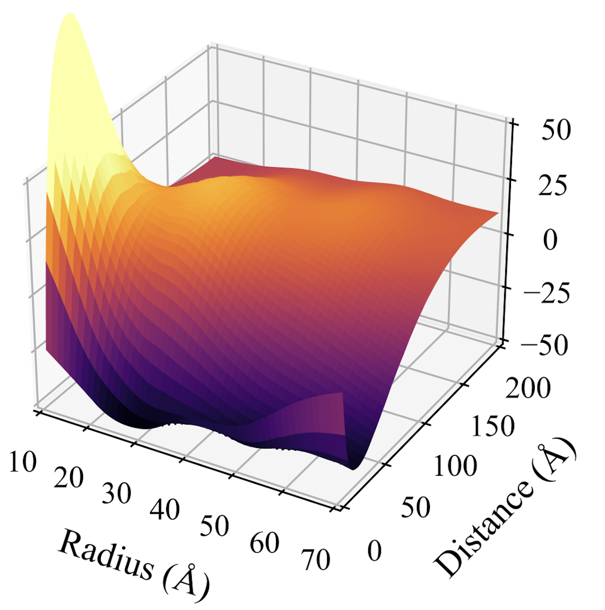

## Hi there 👋, I'm Pablo!

I am a Software Developer and Computational Chemist with a passion for solving complex problems through code. My work focuses on developing software tools and performing data analysis to advance research in chemistry.

- 🔭 I’m currently working on **software development** for **computational chemistry** and **data analysis** for my Ph.D. project at the [Scuola Normale Superiore](https://www.sns.it/en) in Italy.
- 💻 My toolkit includes: Fortran, Python, Git, and more.
- 🌱 I’m currently learning about Rust 🦀.
- 💼 I contribute to the Amsterdam Modeling Suite and nanoFQ projects.
- 📂 Check out my repositories:
  - [FRET_Embedlab](https://github.com/pgrobasillobre/FRET_Embedlab) - Charge-transfer evaluation between molecules mediated by nanoparticles.
  - [GEOM](https://github.com/pgrobasillobre/geom) - Handling of molecular geometries and nanoparticles' design.
- 🤝 I’m open to collaborating on exciting projects related to software development and data science.
- 📫 How to reach me: [pgrobasillobre@gmail.com] | [LinkedIn](https://www.linkedin.com/in/pablo-grobas-illobre-0290b0191/)

⚡ I love experimenting with new data visualization techniques!

    

