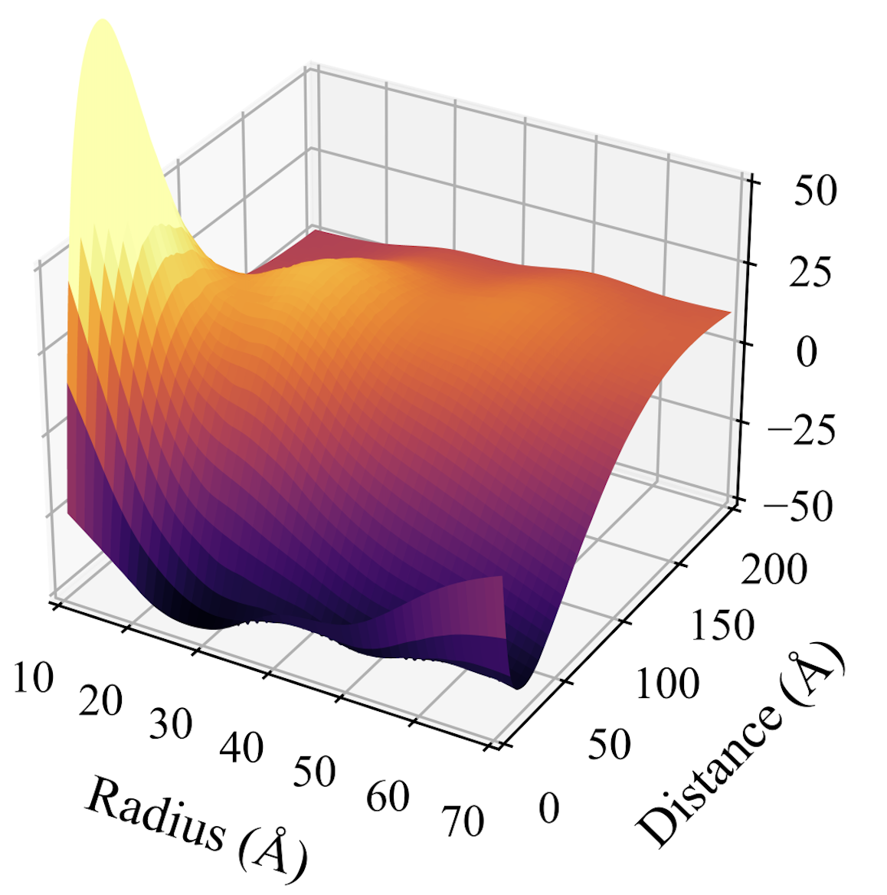

## Hi, I'm Pablo!

I'm a Software Developer and Computational Chemist with a strong focus on scientific programming and quantum chemistry. I specialize in developing high-performance tools to study light–matter interactions at the nanoscale.

Currently, I'm a postdoctoral researcher at the [Scuola Normale Superiore](https://www.sns.it/en) in Pisa, Italy, where I also completed my Ph.D. in Methods and Models for Molecular Sciences. My research combines **quantum chemistry**, **computational spectroscopy**, and **software development** to explore physical phenomena involving plasmonic materials.

### Research & Development Focus

- Development of quantum chemistry software in **Fortran**, in collaboration with [Software for Chemistry & Materials (SCM)](https://www.scm.com/)
- **Python-based** analysis for **data science**, **machine learning**, and **visualization**
- Applied research in:
  - **Plasmonic materials**: graphene and metal nanoparticles  
  - **Plasmon-mediated electronic energy transfer**  
  - **Surface-enhanced spectroscopies**: fluorescence, Raman scattering, and Raman optical activity

### Selected Projects

- [FRET_Embedlab](https://github.com/pgrobasillobre/FRET_Embedlab): Modeling charge-transfer processes mediated by plasmonic nanoparticles  
- [GEOM](https://github.com/pgrobasillobre/geom): Tools for manipulating molecular geometries and nanoparticle design  
- Contributor to [nanoFQ](https://pubs.acs.org/doi/full/10.1021/acsphotonics.2c00761) and the [Amsterdam Modeling Suite](https://www.scm.com/)

### Skills & Tools

- **Languages**: Fortran, Python, Bash  
- **Core libraries**: NumPy, SciPy, Matplotlib, pandas  
- **Tools**: Git, LaTeX, ASE, Jupyter  
- **Focus areas**: Quantum chemistry, scientific computing, machine learning, spectroscopy, data visualization

### About Me

I’m currently transitioning from academia to industry, aiming to apply my skills in software development and data science to solve real-world problems. Long-term, I hope to return to my hometown, A Coruña, and contribute to its local tech and research ecosystem.

📬 Contact: pgrobasillobre@gmail.com  
🔗 [LinkedIn](https://www.linkedin.com/in/grobas-illobre/)

    

